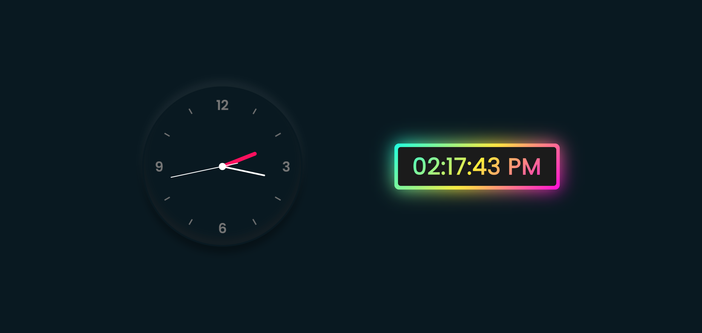

# 🕰️ Digital Clock and Analog Clock

Welcome to the Digital Clock and Analog Clock project! 🌟 This project showcases a simple yet elegant digital and analog clock, designed to help you keep track of time in style.

## Features

- **Digital Clock:** Get precise time displayed digitally in a clear format, making it easy to read at a glance.
- **Analog Clock:** Experience the classic charm of an analog clock with hands ticking away the seconds, minutes, and hours.

## Usage

Simply visit the [demo](https://shakiba-vakili.github.io/digital-clock-and-analog-clock/) to view the clocks in action. You can easily integrate these clocks into your own projects for a touch of timekeeping flair.

## Additional Resources

- **LinkedIn:** Let's connect for collaborations! Find me on [Shakiba Sadat Vakili](https://www.linkedin.com/in/shakiba-vakili/).
- **Email:** Reach out to me at [shakibvakili@gmail.com](mailto:shakibvakili@gmail.com) for any inquiries or collaborations.
- **GitHub:** Visit [@shakiba-vakili](https://github.com/shakiba-vakili) on GitHub for more projects and contributions.

Feel free to explore, contribute, and share this project with others! ⏰
